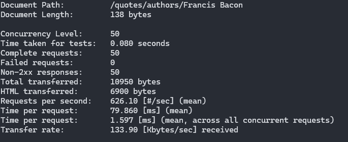
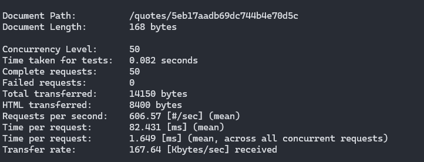
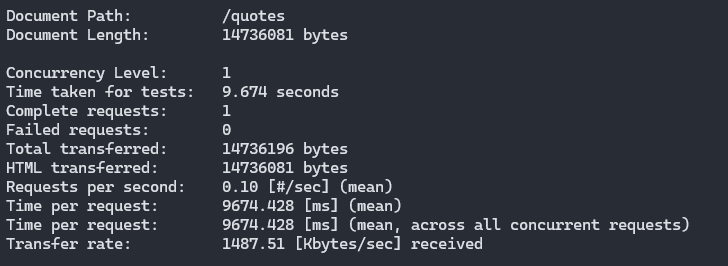

## Tui Challenge

- [x] The app must be able to support 50 requests per second in up to 200 milliseconds for the search functionality by ID
- [x] The app must be able to support 50 requests per second in up to 200 milliseconds for the search functionality by author
- [x] The app must be able to answer in less than 30 seconds for the functionality to search all items in this collection.

### Add index for quoteAuthor field
```bash
    docker exec -i -t mongodb bash
    mongosh 
    use challenge && db.quotes.createIndex({quoteAuthor: 1})
```

## Testing

The test were done with [apache bench](https://httpd.apache.org/docs/2.4/programs/ab.html) a cli tool for benchmarking.<br>
All the test used the same options/flags:
- `-c` Number of multiple request at a time to perform
- `-n` Number of requests to perform for the benchmarking session

### Find By Author results
```
ab -c 50 -n 50 http://localhost:8080/quotes/authors/'Francis Bacon'
```


### Find By Id Results
```
ab -c 50 -n 50 http://localhost:8080/quotes/5eb17aadb69dc744b4e70d5c
```


### Find all Quotes Results
```
ab -c 1-n 1 http://localhost:8080/quotes
```


## Postman Collection
Also, some performance tests can be done on the collection itself
[Collection](Meta%20coding%20challenge.postman_collection.json)